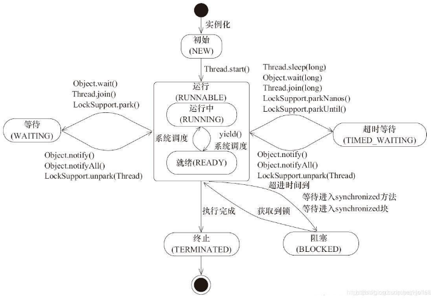

#  Java基础

## 常识

> JDK、JRE、JVM

JDK: Java开发工具，JRE:Java运行时环境，JVM：JAVA虚拟机

JDK

 - JRE(bin目录下)
   - JVM（bin目录下）
   - 类库（lib)

- Java工具
  - javac、java、jconsole

javac编译java文件为class文件，class文件交给不同平台的jvm，然后到类库文件解释class翻译成机器码，最后返回到操作系统

>Java中基本数据类型是什么,各自占用多少字节

byte(1) short(2) int(4) long(8) float(4) double(8) boolean(1/8字节 1bit) char(2)

## 关键字
### statis

 创建工具类时里面的属性或者方法加上static,可以使用类名.属性/方法调用

### final

> 特性

修饰类：表示类不可被继承

修饰方法：表示方法不可被子类重写，但是可以重载

修饰变量：表示变量一旦被赋值久不可以更改它的值

修饰成员变量，在声明时、在代码块中、构造器中赋值。

基本数据类型初始化后不能更改，引用类型初始化后不能再指向另一个对象，引用值能改变。

> 为什么局部内部类和匿名内部类只能访问final变量

外部的类执行完成就会销毁局部变量，而内部类并不会销毁，调用可能出问题，所以就将局部变量复制了一份作为内部类的成员变量，为了使二者一致就用了final修饰。

##　String

> String能被继承吗?

不能，String类有final修饰
> String,Stringbuffer,StringBuilder的区别

String：fianl修饰,每次操作String得到的新的字符串其实是创建了一个新的String对象。经常要修改字符串就不要用String，否则内存中多了无引用的对象就会启动GC，速度会有所影响。

StringBuffer：对原对象进行操作，而不进行创建和回收的操作，速度比String快很多，线程安全，方法使用synchronized修饰的。

StringBuilder：与StringBuffer类似，但会快一些，因为它不是是线程安全的。


## 面向对象

### 面向对象的3个特征

封装：属性私有化，只允许相关方法对外访问，简单的就是get set。你要获取属性也无需关系内部实现。

继承：继承父类得方法，并且可以重写父类的方法或者写自己的方法加以拓展

多态：子类创建实例，父类接受该实例

#### 重载和重写的区别

重载：在同一个类中，方法名必须相同，参数类型、个数、顺序，其他返回值和访问修饰符（public private...）无关,发生在编译时。

重写：子类父类中，方法名、参数列表必须相同，返回值范围、异常抛出范围要小于等于父类，修饰符范围要大于等于父类，父类方法是private子类就无法重写。

### 类的实例化顺序

执行父类的静态属性，静态代码块，静态方法---->执行子类的静态属性，静态代码块，静态方法---->执行父类的属性，代码块，方法，构造方法---->执行子类的属性，代码块，方法，构造方法

### 抽象类和接口的区别

- 抽象类可以存在普通方法和抽象方法，接口中之只能有抽象方法
- 抽象类中成员变量可以是各种类型，而接口中成员变量只能是public static final类型的。
- 抽象类只能继承一个，接口可以实现多个，接口之间也能多继承。

- 抽象类，代码复用，提取出某一事物共有的特征。而接口只对类的行为操作进行约束。

虽然抽象类功能更多，但是Java里面类是单继承，意味着你得考虑子类所有的共性。而接口，类可以实现多个接口，设计起来要轻松许多。

> Integer问题

-128-127会自动缓存,使用==和equals都可比对两个相同的值为true,在此范围外都将会创建新的对象,所以只能用equals比较值。

## 集合

### HashMap

#### HashMap与Hashtable有什么区别?

| 区别               | HashMap | Hashtable |
| :----------------- | ------- | :-------: |
| 键值对是否可以为空 | 可以    |  不可以   |
| 线程是否安全       | 不安全  |   安全    |

#### HashMap具体实现

负载因子 0.75
数组entry 16

- 首先HashMap采用了数组+链表+红黑树.
- 存储数据时会先把key的hashcode进行移位，再与数组长度减1进行&操作设置数组的位置(下标)，查询时只需要取余就能找到具体位置了.
- 确定存在hashcode相等的时候,这个时候就会用到链表,相同的hashcode不同的key的元素就会放到前一个对象的next属性中.
- 当然链表过长查询效率会降低,所以链表长度超过8后,会转为红黑树来提升效率
- 关于扩容,当数组占用达到负载因子和数组长度的乘积时就会扩容,创建一个比初始容量大1倍的数组，遍历原来数组,将链表上的数组再一一遍历拷贝到新的数组上面去
- 如果key为null，hashcode默认为0，会将数据存在数组的第一位

#### HashMap的负载因子为什么为0.75

- 如果负载因子小了,虽然查询效率提高了,但是空间浪费太多了
- 如果负载因子大了,空间节省了,但链表或者红黑树变长了效率就低了,以及扩容时会rehash,将数组里面的数据放到新的数组中,很耗性能

#### 创建一个HashMap的实例，里面put若干元素，循环遍历时调用HashMap的remove方法会报错为什么?

HashMap在遍历时，会初始化一个叫expectedModCount，值等于HashMap的modCount。在遍历时调用HashMap的remove会将modCount++，每次循环会将modCount与expectedModCount比对，显示不同，会抛出异常(fail-fast 快速失败机制)。如果非要移除，可以调用iterator的remove方法，这个会将expectedModCount和modCount再一次的赋值。

### HashMap和Hashtable有什么区别？其底层实现是什么？

Hashtable线程安全，但是用的synchronized修饰，Hashtable不允许key和value为null

### ConcurrentHashMap实现


#### 用过那些Map的实现类，他们有什么区别

HashMap，线程不安全，底层用的数组+链表+红黑树

HashTable，线程安全，但很多方法中都加了synchronize关键字,太慢了。key,value都不能为null

ConcurrentHashMap，线程安全，使用CAS+Synchronize。底层用的数组+链表+红黑树的存储结构，和HashMap一样。

TreeMap，线程非安全，不允许键值为null，实现了SortMap接口，可以自定义排序

LinkedHashMap，线程非安全，允许key和value为空，有序。

### List

#### ArrayList和LinkedList有什么区别

ArrayList的底层实现是数组是Object[]，数组查询快，中间插入删除数据慢。以及需要达到一定长度后还需要扩容，重写复制一份。
LinkedList则是底层实现是链表，查询速度慢,增删数据快，但是插入大量元素也会创建很多Node。

所以二者不能单纯说ArrayList在增加元素方面比LinkedList慢，使用得当也会比LinkedList快。

#### ArrayList(HashSet类似)线程安全吗

不安全，比较modCount不同时就会抛出ConcurrentModificationException，可以使用Vector、Collections.synchronizedList、CopyOnWriteArrayList。但是Vector的实现大多用的Synchronized，而CopyOnWriteArrayList用的是Lock。CopyOnWriteArrayList，底层是写入前先复制一份当前数据，add添加完后，再将新数据覆盖旧数据。

HashSet的底层
HashSet的底层是HashMap

#### List和Set的区别

List：有序，按对象进入的顺序保持对象，可重复，运行多个null元素对象，可以使用迭代器获取元素，下标获取元素。

Set：无序，不可重复，最多允许有一个null元素对象，取对象时只能用迭代器获取，逐一遍历。


## 线程
> 进程和线程

进程有独立的地址空间，一个进程崩溃后，在保护模式下不会对其他进程产生影响。

线程是一个进程中不同的执行路径，线程有自己的堆栈和局部变量，但线程之间没有单独的地址空间，一个线程死掉就等于整个进程死掉，所以多线程的程序要比多线程的程序健壮，但是进程切换时，消耗资源较大，效率要差一些。但对于一些要求同时进行并且又要共享某些变量的并发操作，只能用线程，不能用进程。

> 线程有哪几种状态

NEW: 新建
RUNNABLE: 运行
BLOCKED: 阻塞
WAITING: 等待(一直等)
TIMED_WAITING: 超时等待(超时后就不等了)，
TERMINATED: 终止



> wait/sleep的区别

wait是Object类，sleep是Thread类
wait会释放锁,sleep不会释放
wait必须在同步代码块中，sleep可以再任何地方休眠

> Synchronized和Lock的区别

1、Synchronized 内置Java关键字，Lock Java类
2、Synchronized 无法判断获取锁的状态，Lock 可以判断是否获取到锁
3、Synchronized 会自动释放锁，lock 必须要手动释放锁
4、Synchronized 线程1阻塞，线程2就会一直等待，Lock 不一定会一直等待
5、Synchronized 可重入锁，不可中断，非公平，Lock，可重入锁，可以中断，可以手动设置是否公平
6、Synchronized 适合锁少量代码同步问题，Lock适合锁大量的同步代码块

> static属性，线程锁的是什么

普通属性锁实例，static锁Class.锁不同自然可以同时执行。

> Runnable和Callable的区别

Callable有返回值，会抛出异常,可以用泛型
Runnable调用run(),Callable调用call()

> 最大线程该如何定义

1. CPU密集型, 几核,就是几，可以保持CPU效率最高
2. IO密集型 判断程序中十分耗IO的线程

> Forkjoin

将多个任务拆分为多个任务，当其中一个子任务执行完后会去窃取其他子任务未完成的。最后各个任务又合并为一个任务。

> Volatile

是Java虚拟机提供轻量的同步机制
1、保证可见性
2、不保证原子性
3、禁止指令重排

> volatile可以避免指令重排

1、内存屏障，保证特定操作的执行顺序
2、可以保证某些变量的内存可见性(利用了这些特性volatile实现了可见性)(DCL懒汉式)

> CAS是什么?

比较当前工作中的值和主内存中的值，如果这个值是期望的，那么执行操作，不是就一直循环直到值是期望的。底层是自旋锁。
缺点：
1、循环会耗时
2、一次性只能保持一个共享变量的原子性
3、ABA问题
AtomicXXX compareAndSet(当前值,新值)

> ABA问题

引入原子引用，带版本号的原子操作(AtomicStampedReference),CAS多了两个参数
AtomicStampedReference compareAndSet(当前值,新值,当前版本,新版本)

> 公平锁和非公平锁

公平锁不允许插队
非公平锁允许插队

> 可重入锁

获取到第一把锁，自动获取到里面的第二把锁,后面来的B线程只有等待A线程执行完成。

> 线程优先级setPriority

Thread.MIN_PRIORITY 1

Thread.MAX_PRIORITY 10

Thread.NORM_PRIORITY 5

优先级越大，抢占cpu资源更快，当然也可能抢不到

> join插队

指定一个线程B，抢占当前线程A，线程A一直等待直到线程B完成。如果join设置了时间就超时等待。

> yield礼让

把正在运行的线程变为就绪的线程，之后能不能抢到cpu资源看运气了。

> 守护线程

线程分为用户线程和守护线程，虚拟机必须确保用户线程执行完毕，虚拟机不用等待守护线程(gcw)完毕

## 反射

##  JVM


## 部分API

#### Java中==和equals的区别?

- ==是运算符,用于比较两个变量是否相等,对于基本数据类型而言比较的是变量的值,对于对象类型而言比较的对象是地址
- equals()是Object类的方法,默认实现使用的是==,通常如果只是想比较两个对象的值是否相等需要重写equals方法

#### hashcode和equals的关系?

hashcode()实际返回一个整数，为了确定在hash表中的索引位置，方便快速找到对象。

以HashSet添加为例子，对象进入HashSet时会计算对象的hashcode值判断对象在hash表位置，如果没有就添加，如果已存在就调用equals判断二者是否相同，不同就会散列到其他位置，相同去重，这样有利于提升插入效率。

二者需要同时重写，如果只重写equals，就不符合两个对象相同hashcode也相同。

# JVM

> 程序计数器设计的初衷

程序计数器，记录程序执行到的位置行号，Java是个多线程的语言，CPU没抢夺资源时，挂起，抢到了，就可以根据程序计数器的位置继续执行命令。

# Spring

### 实现一个IOC

- 配置文件中指定需要扫描的包路径
- 定义一些注解,分别表示访问控制层、业务服务层、数据持久层、依赖注λ注解、获取配置文件注解
- 从配置文件中获取需要扫描的包路径，将该路径下所有以class结尾的文件添加到一个Se集合中进行存储
- 遍历这个set集合，获取在类上有指定注解的类，并将其交给IOC容器,定义一个安全的Map用来存储这些对象
- 遍历这个IOC容器,获取到每个类的实例，判断里面是否有依赖其他的类的实例,然后进行递归注入

# MyBatis

# JPA

# 微服务

# 数据库
## MYSQL
>数据量很大,分页查询慢,如何优化?
当limit的偏移量(即第一个参数)特别大时查询速度 
1. 子查询
```sql
select * from orders_history where type=8 and
id>=(select id from orders_history where type=8 limit 100000,1)
limit 100;
```
2. id限定优化
```sql
select * from orders_history where type=2
and id between 1000000 and 1000100 limit 100;
```
```sql
select * from orders_history where id >= 1000001 limit 100;
```
3. in
```sql
select * from orders_history where id in
(select order_id from trade_2 where goods = 'pen')
limit 100;
```
> 乐观锁和悲观锁

乐观锁，当数据要改变的时候需要判断当前version是否符合规定，当数据修改成功后修改版本的version。比如两条sql同时执行，第一条先完成了修改，version也随之改变，那第二条拿到的version就无效了，sql执行并没有意义


> MySQL底层

- 采用B+Tree，非叶子节点不存储数据，只存储索引。

- 叶子节点包含所有索引字段

- 叶子节点用指针连接，提高访问性能

MySQL不用二叉数是由于，插入时可能单边一直增长，导致树的高度增加，导致查询次数非常多。红黑树虽然多了一点平衡机制(右边比左边多2个节点会重新修改节点),但数据越大，树的高度也上来了。B-Tree树(每个节点放指定个元素，大大降低了树的高度)还过得去，但是为了更大的提升性能.
B+Tree,就拿bigint(8字节来算)来存储。
- 非子节点都存索引不存数据。8字节+6字节(指向下一个节点的容量)。 默认mysql数据片大小为16K。16*1024/14 = 1170.
- 叶子节点，假如一个索引和一条数据的空间为1KB，那么起码一个节点就可以存16条数据。
- 那么如果树的高度为3,1170*1170*16 = 2000多万

> MySQL数据存放路径
`show variable like '%dir%'`
Windows放在data下
Linux放在/var/lib/mysql

> MySQL数据文件的含义
*MyISAM*
.frm 表结构,字段长度
.MYD 数据信息文件,存储数据信息
.MYI 索引信息文件
普通索引,叶子节点存指针

*InnoDB*
.ibd(独立表存储模式) 存储数据信息好索引信息
.ibdata1(共存储模式) 存储数据信息和索引信息
.part(分区存储) 用于存储分区信息
聚集索引,叶子节点存数据

> MyISAM和InnoDB之间的区别
MyISAM：不支持事务，锁表,非聚合索引，查询比较快
InnoDB：支持事务，必须有主键
MEMORY：数据放内存，默认使用哈希索引

> InnoDB为什么必须有主键？推荐用主键自增？
InnoDB底层B+Tree就是用主键来维护表中所有的数据。如果自己不设置，InnoDB会自动选一个字段内容不重复的设置为主键，没有那就系统自己建一个字段

> B+Tree和Hash
大部分情况下都用B+Tree,如果单查某个精确的值还hash远大于B+Tree,只需要对索引做一次hash就可以获取到地址，但是如果查询范围Hash就不行了,MySQL中的B+Tree存储数据的节点都会有双向指针。

> 数据库三范式
第一范式：每列不能再分为最小的数据单元
第二范式：满足第一范式，每张表只描述一件事情
第三范式：表中的列不存在对非主键列的传递依赖。比如A表中出现了B表中的一个非主键字段

> 数据库事务(ACID)
原子性：事物是一个完整的操作。要么都执行，要么都失败。
一致性：当事物完成时，数据必须处于一致状态。(比如转账前后，总数是不变的)
隔离性：数据进行修改的所有并发事物是彼此隔离的。一个事务无法影响另一个事务
持久性：事务完成后，持久到硬盘

> 事务隔离级别
read uncommited: 未提交读 读到了没有提交的数据(脏读)
read commited: 不可重复读 提交前读到的数据,和提交后的读到的数据不同(更新)(幻读)
repeatable read: 可重读 查询前的数据结果数和查询后数据结果数变了(插入 删除)(幻读)
serializable: 串行化 锁表

> MySQL当记录不存在时inserrt,当记录存在时update，语句怎么写
insert into interview (id,name,age) values(3,"yyyy",13)
on duplicate key update name ='hahaha',age = 15;

>查看为表格定义的索引
show index from tablename

>LIKE 声明中的%和_是什么意思?
模糊查询,%匹配多个字符，_匹配一个字符(只匹配一个字符).%和_在之前是索引不生效

>char和varchar区别
char固定长度不变,比如char(10)和varchar(10),如果存储'abc'，那么用char长度还是10,varchar则是3。char比varchar存取数据要快。char存储时英文字符占一个字节,中文2个字节,varchar中英文都是2个
## Oracle

# Linux

# TCP/IP